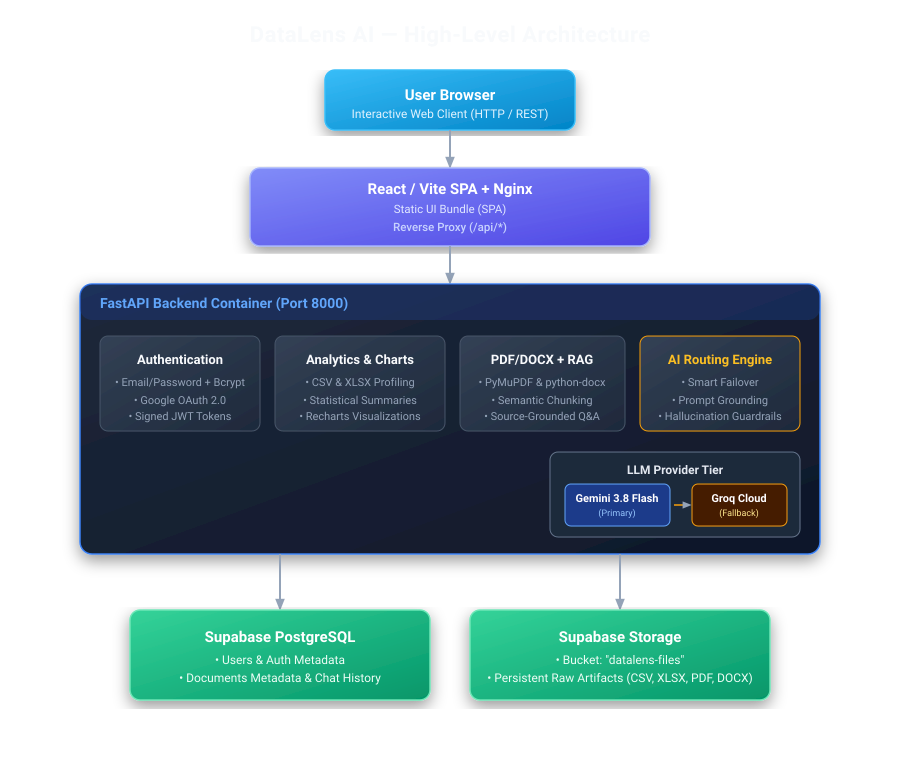
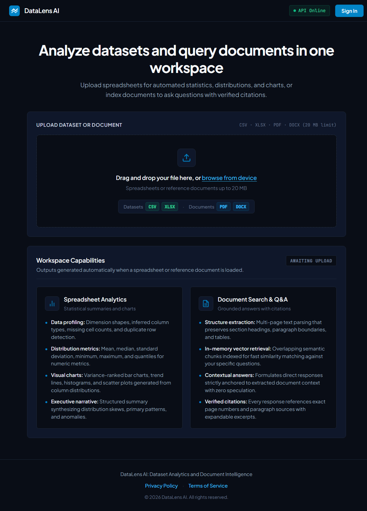
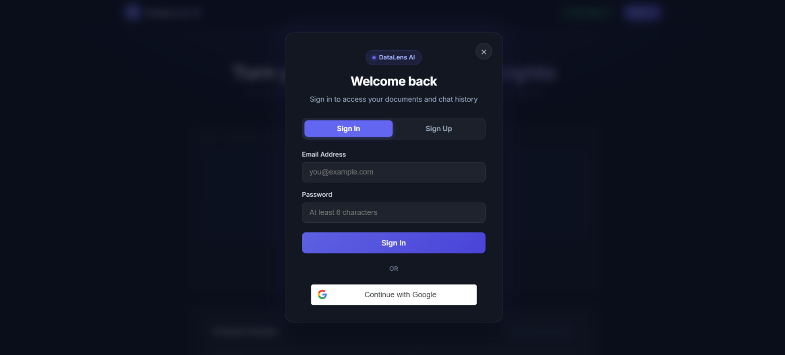

# DataLens AI

DataLens AI is a full-stack data and document intelligence platform designed to analyze both structured datasets (CSV, XLSX) and unstructured documents (PDF, DOCX). For structured data, it automatically performs statistical profiling, detects anomalies, and generates responsive visualizations. For documents, it extracts content and enables conversational exploration through grounded retrieval-augmented generation (RAG) with source citations. By combining programmatic analytics with multi-model LLM routing, DataLens AI provides data insights and grounded document answers within a single unified workspace.

---

## Architecture



---

## Features

- **Tabular Data Analytics (CSV, XLSX)**:
  - Automatic column profiling, missing value detection, data type inference, and statistical summaries (min, max, mean, median, standard deviation).
  - Four purposeful chart types powered by Recharts: **Bar** (categorical comparison), **Line** (trend over time/order), **Histogram** (distribution), and **Scatter** (relationship between two variables).
- **Document Extraction & Grounded RAG (PDF, DOCX)**:
  - Text and structure extraction using PyMuPDF and python-docx.
  - Overlapping chunking and semantic vector search (`sentence-transformers`).
  - Strict grounding: answers cite exact page numbers and explicitly state when information is unavailable rather than hallucinating.
- **Dual-LLM Routing**:
  - **Google Gemini 3.8 Flash** (`google-genai`) as the high-speed primary model.
  - Automatic failover to **Groq Cloud** (`openai/gpt-oss-20b`) if Gemini hits rate limits, timeouts, or network errors.
- **Authentication & User Isolation**:
  - Email/Password authentication with salted `bcrypt` hashing and Google OAuth 2.0 (Google Identity Services).
  - Secure signed JWT sessions (24-hour expiration).
  - Strict tenant isolation: all documents and chat messages are scoped to the authenticated user.
  - File upload and analysis strictly require authentication. Unauthenticated visitors can view the landing page and authentication modal.
- **Cloud-Native Database & Storage**:
  - **PostgreSQL (Supabase)**: Persistent storage for users, document metadata, and chat history. SQLite is disabled for production application use.
  - **Supabase Storage**: Persistent file storage in the `datalens-files` bucket, with a local ephemeral cache (`data/uploads/`) for fast Python processing.
- **Full Docker Support**:
  - Containerized with Docker Compose using a multi-stage Nginx frontend build and a Python 3.11-slim FastAPI backend.

---

## Screenshots

### Landing Page & Workspace
Initial view featuring the drag-and-drop file ingestion zone, supported formats, and application navigation:



### Authentication
Authentication modal supporting email/password sign-in and Google OAuth 2.0:



---

## Tech Stack

| Layer | Technologies |
| :--- | :--- |
| **Frontend** | React 19, Vite, Recharts, Lucide Icons, Vanilla CSS |
| **Backend** | Python 3.11, FastAPI, Uvicorn, Pydantic v2, SQLAlchemy 2.0 |
| **Data Processing** | Pandas, OpenPyXL, NumPy |
| **Document & RAG** | PyMuPDF (fitz), python-docx, Sentence-Transformers |
| **AI / LLMs** | Google Gemini (`gemini-3.8-flash`), Groq (`openai/gpt-oss-20b`) |
| **Database & Storage** | Supabase PostgreSQL, Supabase Storage (`datalens-files`) |
| **Authentication** | JWT (PyJWT), Passlib/Bcrypt, Google Identity Services |
| **DevOps** | Docker, Docker Compose, Nginx |

---

## Project Structure

```text
DataLens-AI/
|-- backend/
|   |-- app/
|   |   |-- api/          # Route endpoints (auth, upload, analyze, insights, documents, health)
|   |   |-- core/         # Settings, config validation, and JWT authentication
|   |   |-- db/           # SQLAlchemy models and PostgreSQL session management
|   |   |-- services/     # Analysis, document extraction, dual-LLM routing, RAG, and storage
|   |   `-- main.py       # FastAPI application entry point
|   |-- tests/            # Backend test suite
|   |-- Dockerfile        # Backend container definition
|   `-- requirements.txt  # Python dependencies
|-- frontend/
|   |-- src/
|   |   |-- components/   # React components (UploadZone, ChartPanel, DocumentChat, AuthModal, SignOutModal)
|   |   |-- services/     # API client and authentication token state
|   |   |-- App.jsx       # Main application layout and state
|   |   `-- main.jsx      # React entry point
|   |-- Dockerfile        # Multi-stage frontend container (Vite build + Nginx)
|   |-- nginx.conf        # Nginx reverse proxy routing (/api/ -> backend:8000)
|   `-- package.json      # Node.js dependencies and scripts
|-- docs/
|   `-- architecture-diagram.svg  # System architecture diagram
|-- docker-compose.yml    # Docker Compose multi-container setup
|-- .env.example          # Environment variables template
`-- README.md             # Project documentation
```

---

## Quickstart with Docker

The easiest way to run DataLens AI locally with full production parity:

### 1. Clone & Configure Environment
```bash
git clone <repository-url>
cd DataLens-AI

# Create root .env file from template
cp .env.example .env
```
Edit `.env` with your Supabase credentials, database URL, and API keys (see [Environment Variables](#environment-variables)).

### 2. Build & Start Containers
```bash
docker compose up -d --build
```

### 3. Access the Application
- **Frontend UI**: [http://localhost:5173](http://localhost:5173) or [http://localhost:3000](http://localhost:3000)
- **Backend API**: [http://localhost:8000](http://localhost:8000)
- **API Docs (Swagger UI)**: [http://localhost:8000/docs](http://localhost:8000/docs)

### 4. Check Health & Logs
```bash
# Check container status
docker compose ps

# View backend logs
docker compose logs -f backend
```

---

## Local Development Setup

If you prefer running frontend and backend directly on your host machine:

### Prerequisites
- Python 3.11+
- Node.js 20+
- Active Supabase project (PostgreSQL + `datalens-files` storage bucket)

### 1. Backend Setup
```bash
cd backend
python -m venv venv

# Activate virtual environment
# On Windows:
.\venv\Scripts\Activate.ps1
# On macOS/Linux:
source venv/bin/activate

# Install dependencies
pip install -r requirements.txt

# Configure backend environment
cp ../.env.example .env
# Edit backend/.env with your credentials

# Run FastAPI server
uvicorn app.main:app --reload --host 0.0.0.0 --port 8000
```

### 2. Frontend Setup
In a separate terminal:
```bash
cd frontend
npm install
npm run dev
```
The Vite development server will start at [http://localhost:5173](http://localhost:5173), automatically proxying `/api` calls to `http://localhost:8000`.

---

## Environment Variables

Configure these keys in your `.env` file. **Never commit real secrets or API keys to version control.**

```ini
# Environment
APP_ENV=production
APP_HOST=0.0.0.0
APP_PORT=8000

# File Storage
UPLOAD_DIR=data/uploads
MAX_UPLOAD_SIZE_MB=20
STORAGE_BACKEND=supabase
SUPABASE_URL=https://<your-project-id>.supabase.co
SUPABASE_KEY=<your-supabase-service-role-or-secret-key>
SUPABASE_STORAGE_BUCKET=datalens-files

# Database (PostgreSQL only)
DATABASE_URL=postgresql://postgres:<password>@<host>:5432/<database>

# AI / LLM
GEMINI_API_KEY=<your-gemini-api-key>
GEMINI_MODEL=gemini-3.8-flash
GROQ_API_KEY=<your-groq-api-key>
GROQ_MODEL=openai/gpt-oss-20b
GROQ_BASE_URL=https://api.groq.com/openai/v1

# Authentication & Security
GOOGLE_CLIENT_ID=<your-google-oauth-client-id>.apps.googleusercontent.com
JWT_SECRET_KEY=<your-random-jwt-secret-min-32-chars>
JWT_ALGORITHM=HS256
JWT_EXPIRE_MINUTES=1440

# CORS
CORS_ORIGINS=http://localhost:5173,http://localhost:3000,http://localhost:8000
```

---

## User Workflow

1. **Sign In**: Register an account with email/password or sign in with Google.
2. **Upload**: Drag and drop a `.csv`, `.xlsx`, `.pdf`, or `.docx` file (up to 20 MB).
3. **Inspect**:
   - **For tabular files**: View dataset shape, column metrics, null percentage, and interactive Recharts visualizations.
   - **For documents**: Review document structure and chunk count.
4. **Generate Insights**: Click **Generate AI Insights** to produce an executive analytical summary via Gemini (with automatic Groq fallback).
5. **Ask Questions (RAG)**: Chat with uploaded PDFs or Word documents. Every answer includes specific page-number citations grounded in the text.
6. **Switch Documents**: Browse and switch between previous files in the History sidebar with preserved chat and analytical state.
7. **Sign Out**: Click **Sign Out** and confirm via the dialog to securely clear the session.

---

## Limitations & Future Scope

### Current Limitations
- **File Size**: Uploads capped at 20 MB per file.
- **Single File Context**: Conversations focus on one active file at a time rather than querying across multiple files simultaneously.
- **Scanned Documents**: PDFs without selectable digital text require OCR before text can be extracted.

### Roadmap
- [ ] Asynchronous background ingestion with Celery and Redis for larger datasets.
- [ ] Multi-document cross-comparison and synthesis.
- [ ] OCR integration (Tesseract/Textract) for scanned physical documents.
- [ ] One-click export of charts and executive summaries to PDF or PowerPoint.

---

## License

This project is licensed under the [MIT License](LICENSE).
